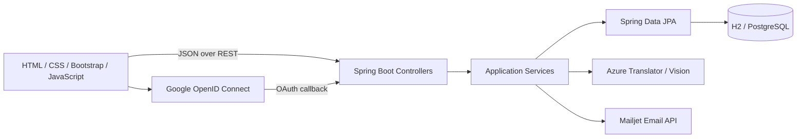

# Flashcard Learning App

[](https://openjdk.org/projects/jdk/21/)
[](https://spring.io/projects/spring-boot)
[](https://getbootstrap.com/)
[](https://www.postgresql.org/)

Flashcard Learning App là ứng dụng web tạo và học bộ từ vựng cá nhân. Người dùng có thể sắp xếp flashcard theo thư mục, học bằng nhiều chế độ, làm bài kiểm tra, chơi game ghép thẻ và dùng nhận dạng chữ viết tay.

Frontend là static SPA viết bằng HTML, CSS, Bootstrap và JavaScript thuần. Backend Spring Boot chỉ cung cấp REST API và không render dữ liệu qua Thymeleaf, nhờ đó hai phần có hợp đồng rõ ràng và có thể được triển khai độc lập khi hệ thống mở rộng.

## Tính năng

- Đăng nhập bằng Google hoặc email/mật khẩu có xác minh OTP.
- Thiết bị tin cậy 30 ngày, phiên mật khẩu 3 ngày và phiên Google 30 ngày.
- Thư viện cá nhân với tìm kiếm và thư mục.
- Tạo, chỉnh sửa và xoá bộ flashcard.
- Học bằng thẻ lật, câu hỏi lựa chọn hoặc nhập đáp án.
- Bài kiểm tra tuỳ chỉnh số câu, thời gian và chiều ôn tập.
- Game ghép cặp có chấm điểm.
- Gợi ý nghĩa và phiên âm qua Azure Translator.
- Nhận dạng đáp án viết tay qua Azure AI Vision.
- Dashboard quản trị, thống kê và khoá/mở tài khoản.
- Phân quyền `ROLE_USER` và `ROLE_ADMIN`.

## Kiến trúc



Controller xử lý HTTP và DTO, service giữ nghiệp vụ và transaction, repository phụ trách truy cập dữ liệu, còn entity đại diện cho mô hình persistence. Frontend được chia theo `core`, `app` và từng `features`, tránh dồn routing, state và nghiệp vụ giao diện vào một file lớn.

### Xác thực và bảo mật

- Phiên ứng dụng dùng OAuth2 Resource Server, access JWT HS256 15 phút và refresh token xoay vòng lưu dạng hash trong database. HTTP session chỉ tồn tại tạm thời trong lúc bắt tay Google OAuth.
- Backend gửi access JWT, refresh token và token thiết bị bằng header `Set-Cookie`; cookie có `HttpOnly`, `SameSite` và `Secure` trong production.
- Frontend không đọc JWT và không lưu token trong `localStorage` hoặc `sessionStorage`.
- Đăng nhập mật khẩu yêu cầu OTP email trên thiết bị chưa tin cậy. Mã OTP hết hạn, chỉ dùng một lần, bị giới hạn số lần thử và chỉ lưu HMAC trong database.
- Google được liên kết bằng `issuer + subject`; email trùng không bị tự động gộp. Tài khoản cũ phải xác nhận mật khẩu trước khi liên kết, nên giữ nguyên `user_id` và dữ liệu học tập.
- Các request thay đổi dữ liệu dùng CSRF token qua header `X-XSRF-TOKEN`.
- Quyền sở hữu dữ liệu được kiểm tra ở service; API quản trị yêu cầu `ROLE_ADMIN`.
- CSP, chống nhúng iframe, Referrer Policy, Permissions Policy và rate limit cho auth/API tốn quota được cấu hình sẵn.

Xem chi tiết tại [docs/security.md](docs/security.md) và [docs/mvc-flow.md](docs/mvc-flow.md).

## Công nghệ

| Thành phần | Công nghệ |
| --- | --- |
| Frontend | HTML5, CSS3, Bootstrap 5.3, JavaScript ES Modules |
| Backend | Java 21, Spring Boot 3.3.5, Spring Web, Spring Security |
| Persistence | Spring Data JPA, Hibernate |
| Database | H2 cho local, PostgreSQL/Neon cho production |
| Security | OAuth2 Client/Resource Server, OpenID Connect, JWT, BCrypt, OTP, CSRF |
| Tích hợp | Google Identity, Mailjet Email API, Azure Translator, Azure AI Vision |
| Build | Gradle Wrapper hoặc Maven |
| Deploy | Docker, Render |

## Bắt đầu nhanh

### Yêu cầu

- JDK 21
- Git
- Docker là tuỳ chọn nếu muốn chạy bằng container

### Cài đặt

```bash
git clone https://github.com/QuanVu512/flashcard.git
cd flashcard
```

Ứng dụng mặc định dùng H2 file nên không cần cài database ngoài. Để đăng ký và đăng nhập bằng mật khẩu, hãy cấu hình Mailjet theo mục bên dưới trước khi tạo tài khoản.

Trên Windows:

```powershell
.\gradlew.bat bootRun
```

Trên macOS hoặc Linux:

```bash
./gradlew bootRun
```

Mở [http://localhost:8000](http://localhost:8000) và tạo tài khoản đầu tiên.

Nếu dùng Maven đã cài trên máy:

```bash
mvn spring-boot:run
```

## Cấu hình

Ứng dụng đọc biến môi trường và file `.env` ở thư mục gốc. Sao chép `.env.example` thành `.env`, sau đó chỉ điền các dịch vụ cần dùng.

| Biến | Bắt buộc | Mô tả |
| --- | --- | --- |
| `SPRING_PROFILES_ACTIVE` | Production | Dùng `dev` cho local hoặc `prod` khi deploy |
| `DATABASE_URL` | Production | JDBC URL của PostgreSQL/Neon |
| `DATABASE_USERNAME` | Production | Tài khoản database |
| `DATABASE_PASSWORD` | Production | Mật khẩu database |
| `JWT_SECRET` hoặc `JWT_BASE64_SECRET` | Production | Secret ngẫu nhiên tối thiểu 32 byte |
| `AUTH_OTP_HASH_SECRET` | Có | Secret riêng tối thiểu 32 byte để HMAC mã OTP |
| `AUTH_MAIL_ENABLED` | Có với đăng nhập mật khẩu | Bật gửi OTP qua email |
| `AUTH_MAIL_PROVIDER` | Có khi bật email | Đặt thành `mailjet` để sử dụng Mailjet Send API |
| `AUTH_MAIL_FROM` | Có khi bật email | Địa chỉ người gửi đã được nhà cung cấp xác minh |
| `MAILJET_API_KEY`, `MAILJET_SECRET_KEY` | Khi provider là `mailjet` | Thông tin xác thực Send API của Mailjet |
| `GOOGLE_AUTH_ENABLED` | Không | Bật đăng nhập Google |
| `GOOGLE_CLIENT_ID`, `GOOGLE_CLIENT_SECRET` | Khi bật Google | OAuth 2.0 Web Client trên Google Auth Platform |
| `APP_FRONTEND_BASE_URL` | Khi frontend khác origin | Origin frontend để callback Google quay lại đúng SPA |
| `AUTH_COOKIE_SECURE` | Không | Mặc định `false` ở dev và `true` ở prod |
| `AUTH_COOKIE_SAME_SITE` | Không | `Lax`, `Strict` hoặc `None` |
| `ADMIN_EMAIL` | Không | Email tài khoản được tạo/nâng quyền admin khi khởi động |
| `ADMIN_PASSWORD` | Không | Mật khẩu bootstrap admin |
| `AZURE_TRANSLATOR_KEY` | Không | Bật gợi ý dịch khi provider là `azure` |
| `AZURE_VISION_KEY` | Không | Bật nhận dạng chữ viết khi provider là `azure` |

Không commit `.env`, database local hoặc secret thật. Profile `prod` yêu cầu `JWT_SECRET`/`JWT_BASE64_SECRET` được cấu hình và không dùng secret phát triển mặc định.

### OTP email qua Mailjet

Mailjet API sử dụng HTTPS nên hoạt động trên Render Free, nơi các cổng SMTP phổ biến bị chặn. Xác minh địa chỉ người gửi trong Mailjet rồi cấu hình:

```properties
AUTH_MAIL_ENABLED=true
AUTH_MAIL_PROVIDER=mailjet
AUTH_MAIL_FROM=your-verified-sender@example.com
MAILJET_API_KEY=your-mailjet-api-key
MAILJET_SECRET_KEY=your-mailjet-secret-key
MAILJET_API_URL=https://api.mailjet.com
MAILJET_SENDER_NAME=Flashcard
AUTH_OTP_HASH_SECRET=another-random-secret-at-least-32-bytes
```

Không commit API key hoặc Secret key. Chỉ lưu các secret này trong `.env` local hoặc phần Environment của nền tảng triển khai.

### Đăng nhập Google

Tạo OAuth 2.0 Client loại **Web application** trong Google Auth Platform, sau đó thêm redirect URI:

```text
http://localhost:8000/login/oauth2/code/google
```

Cấu hình local:

```properties
GOOGLE_AUTH_ENABLED=true
GOOGLE_CLIENT_ID=your-google-client-id
GOOGLE_CLIENT_SECRET=your-google-client-secret
GOOGLE_REDIRECT_URI={baseUrl}/login/oauth2/code/google
```

Production phải đăng ký thêm URI HTTPS đúng domain, ví dụ `https://app.example.com/login/oauth2/code/google`. Đăng nhập Google OAuth không yêu cầu bật Cloud Billing.

### PostgreSQL hoặc Neon

```properties
DATABASE_URL=jdbc:postgresql://host/database?sslmode=require
DATABASE_USERNAME=your-username
DATABASE_PASSWORD=your-password
```

Flyway quản lý thay đổi schema. Migration xác thực bổ sung identity, OTP, refresh session và trusted device nhưng không xoá hoặc tạo lại `users`, `clients`, folder hay flashcard. Tài khoản cũ giữ nguyên UUID và quan hệ dữ liệu; email cũ được đánh dấu chưa xác minh cho đến khi hoàn tất OTP hoặc liên kết Google bằng mật khẩu hiện tại.

### Azure Translator

```properties
TRANSLATION_PROVIDER=azure
TRANSLATION_DEFAULT_TARGET=vi
AZURE_TRANSLATOR_KEY=your-key
AZURE_TRANSLATOR_REGION=global
AZURE_TRANSLATOR_ENDPOINT=https://api.cognitive.microsofttranslator.com
```

### Azure AI Vision

```properties
HANDWRITING_PROVIDER=azure
AZURE_VISION_KEY=your-key
AZURE_VISION_ENDPOINT=https://your-resource.cognitiveservices.azure.com
```

### Frontend ở domain riêng

Khi frontend và backend khác origin, cấu hình chính xác origin của frontend và cho phép cookie:

```properties
APP_CORS_ALLOWED_ORIGINS=https://app.example.com
APP_FRONTEND_BASE_URL=https://app.example.com
AUTH_COOKIE_SECURE=true
AUTH_COOKIE_SAME_SITE=None
```

Không dùng wildcard CORS cùng credential.

Trong bản frontend được deploy riêng, đặt URL backend trong `index.html`:

```html
<meta name="flashcard-api-base-url" content="https://api.example.com">
```

## REST API chính

| Method | Endpoint | Chức năng |
| --- | --- | --- |
| `POST` | `/api/auth/register` | Tạo tài khoản và gửi OTP xác minh email |
| `POST` | `/api/auth/login` | Xác thực mật khẩu và yêu cầu OTP khi cần |
| `POST` | `/api/auth/otp/verify` | Xác minh OTP và tuỳ chọn nhớ thiết bị |
| `POST` | `/api/auth/otp/resend` | Gửi lại OTP theo thời gian chờ |
| `POST` | `/api/auth/refresh` | Xoay refresh token và cấp access JWT mới |
| `GET` | `/api/auth/google/start` | Bắt đầu Google OpenID Connect |
| `POST` | `/api/auth/google/link` | Liên kết Google với tài khoản cũ sau khi xác nhận mật khẩu |
| `GET` | `/api/auth/me` | Lấy hồ sơ hiện tại |
| `POST` | `/api/auth/logout` | Xoá cookie xác thực |
| `GET` | `/api/library` | Lấy thư viện của người dùng |
| `GET/POST` | `/api/folders` | Đọc hoặc tạo thư mục |
| `POST` | `/api/sets` | Tạo bộ thẻ |
| `GET/PUT/DELETE` | `/api/sets/{id}` | Đọc, cập nhật hoặc xoá bộ thẻ |
| `GET` | `/api/sets/{id}/learn` | Tạo phiên Learn |
| `GET` | `/api/sets/{id}/test` | Tạo phiên Test |
| `GET/PATCH` | `/api/admin/**` | API quản trị |

Response lỗi API dùng JSON thống nhất với `message`, `status`, `details` và `timestamp`.

## Cấu trúc dự án

```text
src/main/java/com/flashcardapp/
├── config/          # Security, JWT, CORS và configuration properties
├── controller/      # REST endpoints và SPA fallback
├── dto/             # Request/response contracts
├── entity/          # JPA entities
├── repository/      # Data access
├── service/         # Business logic và transaction boundaries
└── helper/          # Security, errors, logging và response utilities

src/main/resources/
├── static/
│   ├── js/
│   │   ├── app/      # Router và global event orchestration
│   │   ├── core/     # API client, state, navigation và utilities
│   │   ├── features/ # Auth, library, admin, study, practice và game
│   │   └── main.js   # Composition root của frontend
│   └── css/          # Stylesheet của ứng dụng
└── templates/        # HTML fragments được phục vụ tĩnh qua /views/**
    ├── admin/        # Giao diện quản trị
    ├── auth/         # Đăng nhập, đăng ký, OTP và liên kết Google
    ├── error/        # Giao diện lỗi phía SPA
    └── fragments/    # Shell và component tái sử dụng
```

Thư mục `templates` chỉ dùng để phân loại HTML fragment cho frontend. Project không cài Thymeleaf và backend không truyền `Model` vào các file này.

## Triển khai

Repository có sẵn `Dockerfile` multi-stage và `render.yaml`. Khi triển khai production:

1. Cấu hình PostgreSQL/Neon, JWT secret, OTP secret và Mailjet Email API.
2. Đặt `SPRING_PROFILES_ACTIVE=prod`.
3. Thêm Google OAuth và Azure keys nếu bật các tính năng tương ứng.
4. Không đưa secret vào image hoặc repository.

Hướng dẫn chi tiết: [docs/deploy-render-docker.md](docs/deploy-render-docker.md).

## Tài liệu

- [Nền tảng và phạm vi sản phẩm](docs/project-foundation.md)
- [Luồng SPA và REST API](docs/mvc-flow.md)
- [Mô hình bảo mật](docs/security.md)
- [Quy trình build và kiểm thử](docs/build-test-workflow.md)
- [Triển khai Docker trên Render](docs/deploy-render-docker.md)

## Đóng góp

Issue và pull request nên mô tả rõ hành vi hiện tại, hành vi mong muốn và phạm vi thay đổi. Giữ controller mỏng, đặt nghiệp vụ trong service, dùng DTO ở biên API và không để frontend phụ thuộc trực tiếp vào entity backend.
